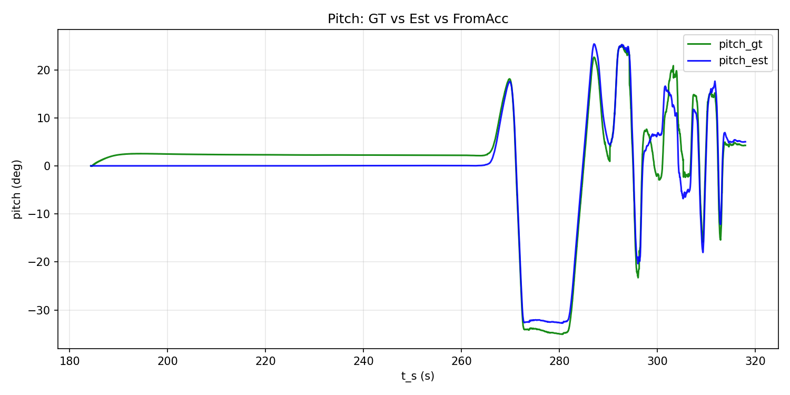

# 3DoF Orientation Estimation

Error State Kalman Filter (ESKF) for three-degree-of-freedom orientation estimation using IMU (gyroscope + accelerometer) and scalar forward velocity.

---

## How to Run

### Build

```bash
cd /path/to/MOKUKU-INS
mkdir -p build && cd build
cmake ..
make
```

### Run

```bash
./3dof/3dof_kalman_filter_main
```

**Input data** (configured in `3dof_kalman_filter_main.cc`):

- `3dof/test_data/imu.csv` — IMU samples (timestamp_ns, acc_x, acc_y, acc_z, gyr_x, gyr_y, gyr_z)
- `3dof/test_data/odom.txt` — Trajectory poses (timestamp_ns, Rwc 3×3, velocity)

**Output**:

- Console: per-frame pitch estimates, bias estimates, and summary statistics

---

## Algorithm Flow (Overview)

1. **Load data** — IMU CSV and trajectory odom.txt; clip IMU to trajectory time range.
2. **Bias estimation** — Use first N seconds from segment start to estimate accelerometer and gyroscope biases from gravity and near-zero angular velocity.
3. **Filter loop** (per IMU frame):
   - **Predict**: Integrate gyroscope to update R_wc; R_cm nearly constant; add process noise to P.
   - **Update** (when `|dv/dt|` below threshold): Compare accelerometer with expected specific force from kinematics (`a_body = [0, dv/dt, 0] + ω×v`, then subtract gravity); correct R_wc and R_cm via Kalman gain.
4. **Output** — R_wc (vehicle-to-world), R_cm (device-to-vehicle); extract pitch for inclination.

**Observation model**: Expected specific force in IMU frame is `h = R_cmᵀ · (a_body - R_wcᵀ·g)`, where `a_body` uses velocity derivative and Coriolis term. Residual `y = acc_imu - h` drives the correction.

---

## Observability and Pitch Focus

**Due to insufficient observation constraints**, the filter is designed to focus on **pitch angle estimation**:

- **Pitch**: Observable from the accelerometer (gravity projection and longitudinal acceleration). The filter corrects pitch using the accelerometer residual.
- **Yaw**: Not observable from accelerometer alone; no magnetometer or other heading reference. Yaw drifts with gyroscope integration.
- **Roll**: Assumed small; weakly observable in full 3D motion.

**Overall angle estimation** (especially yaw and total 3D rotation) is therefore **relatively dependent on gyroscope integration**. The accelerometer mainly constrains pitch and roll to a lesser extent. Evaluation metrics (e.g. mean pitch error) focus on pitch, which is the best-constrained degree of freedom.

---

## Limitations

- **Yaw unobservable**: No magnetometer or heading reference; yaw drifts with gyroscope integration. Total 3D rotation error can be large even when pitch is accurate.
- **2D motion assumption**: Vehicle moves primarily along the forward (Y) axis; lateral velocity is neglected. Significant lateral motion degrades the observation model.
- **External velocity required**: Filter needs scalar forward velocity (from odometry, GNSS, or wheel encoder). No velocity estimation from IMU alone.
- **Axis/sign convention sensitive**: Accelerometer sign depends on sensor mounting (`inverse_imu_acc`). Misalignment causes systematic pitch bias.
- **Bias estimation from static segment**: Bias is estimated from the first N seconds of the processing segment. Thermal drift or motion during this period affects accuracy.
- **dv/dt noise**: Velocity derivative amplifies noise; large |dv/dt| triggers update skip. Very noisy velocity input degrades pitch estimation.

---

## Example Run Results

```
[INFO] Data dir: /path/to/3dof/test_data/ (imu.csv, odom.txt)
[INFO] Loaded 45206 IMU samples from .../imu.csv
[INFO] Loaded 8872 trajectory poses from .../odom.txt
[INFO] Trajectory velocity smoothed with window=5 samples (moving average).
[INFO] [Trajectory clip] Traj time ... -> IMU indices [18426, 31799), N=13373
[INFO] [Bias estimate] 60 s from segment start: acc from 5998 samples, gyr from 5992 with |gyr|<0.02 rad/s; bias_acc=[...], bias_gyr=[...]
[INFO] [Motion start] frame=26462, t_s=264.664, vel=0.100724 m/s, pitch_est=-1.76 deg, pitch_gt=2.18 deg, pitch_err=-3.94 deg
...
[INFO] [Summary] Rwc: mean angle error = 0.397 rad (22.77 deg), max = 3.14 rad (179.9 deg), over 6687 frames.
[INFO]   Rwc pitch mean error = 2.49143 deg.
[INFO]   R_total (=Rwc*Rcm, IMU-to-world) vs gt: mean angle = 22.77 deg, mean pitch err = 2.49 deg
[INFO]   R_cm mean pitch = -0.002 deg.
[INFO] Finished.
```

**Interpretation**:

- `Rwc pitch mean error = 2.49 deg` — Mean pitch error of vehicle-to-world rotation vs. ground truth.
- `Rwc mean angle error = 22.77 deg` — Total 3D rotation error is large because yaw is unobservable and drifts; pitch is the constrained component.
- `R_cm mean pitch ≈ 0 deg` — Device-to-vehicle pitch (mounting tilt) stays near zero when IMU is aligned with vehicle.




---

## Detailed Algorithm (Reference)

### State Variables

| State | Description |
|-------|-------------|
| R_wc | Vehicle-to-world rotation (3×3) |
| R_cm | Device-to-vehicle rotation (3×3) |
| P | Error state covariance 6×6 [δθ_wc, δθ_cm] |

### Prediction

- R_wc updated by gyro: `ω_car = R_cm·ω_imu`, `R_wc_new = R_wc·exp(ω_car·dt)`
- R_cm nearly constant; P += Q·dt

### Observation

- `a_body = [0, dv/dt, 0] + ω×[0,v,0]`
- `f_car = a_body - R_wcᵀ·g`
- `h = R_cmᵀ·f_car`
- Residual: `y = acc_imu - h`

### Config Parameters

All parameters are in `Config` struct in `3dof_kalman_filter_main.cc`.

**Data & preprocessing**:

| Parameter | Default | Description |
|-----------|---------|-------------|
| data_dir | `3dof/test_data` | Directory containing imu.csv and odom.txt |
| start_ratio | 0.0 | Start of processing segment as fraction of trajectory clip [0,1] |
| end_ratio | 1.0 | End of processing segment as fraction of trajectory clip [0,1] |
| update_interval | 1 | Run Update every N IMU frames (1 = every frame) |
| inverse_imu_acc | true | Negate accelerometer if sensor convention has +g when level |
| estimate_bias_seconds | 6.0 | Seconds from segment start used for bias estimation |
| gyr_bias_max_rad_s | 0.02 | Max \|ω\| [rad/s] for gyro samples included in bias averaging |
| vel_smooth_window | 5 | Moving-average window for trajectory velocity smoothing |
| vel_motion_threshold | 0.1 | Velocity [m/s] above which "motion start" is logged |

**Filter parameters** (passed to FilterParams):

| Parameter | Default | Description |
|-----------|---------|-------------|
| q_wc | 0.01 | R_wc process noise [rad/√s] |
| q_cm | 1e-8 | R_cm process noise |
| r_acc | 0.08 | Accelerometer observation noise [m/s²] |
| max_dv_dt_mps2 | 8.0 | Clamp \|dv/dt\| to this boundary |
| dv_dt_skip_threshold | 1.0 | Skip Update when \|dv/dt\| > this [m/s²] |
| p0_rwc, p0_rcm_* | 1, 1e-8 | Initial error covariance diagonal |

---

## Coordinate Frames

- **World**: Z-up; g = [0, 0, 9.81]ᵀ
- **Vehicle (car)**: X-right, Y-forward, Z-up
- **Device (IMU)**: Same when R_cm = I; R_cm models mounting tilt
